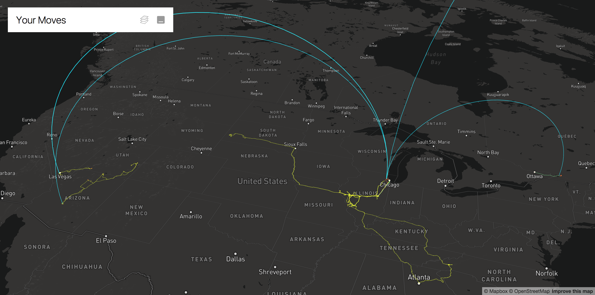

# Moves On Deck

Moves On Deck is a WebGL-powered visualization of your [Moves-App](https://www.moves-app.com/) location history built with React and Uber's Deck.gl framework.

## Usage

This project is currently available at <https://projects.claygregory.com/moves-on-deck/>. Data processing is entirely client-side in browser, so there's no need to deploy your own copy if just interested as an end-user.



## Development

If you're interested in local development, the provided Gulpfile will allow you build and run your own copy. However, you'll need to supply your own Mapbox API key.

### Setup

From the project root, install the required dependencies with either NPM or Yarn:
```bash
npm install
```
or
```bash
yarn
```

### Running Locally

By default, running Gulp will build the project and launch a local webserver on port 8000 with hot-reloading enabled. To use the Mapbox layer, you'll need to supply a Mapbox API key specific to your distribution. Your can request a free key from [Mapbox](https://www.mapbox.com) for limited usage. This key will be statically inlined from the `MAPBOX_ACCESS_TOKEN` environmental variable using [envify](https://github.com/hughsk/envify):
```bash
MAPBOX_ACCESS_TOKEN=your_token gulp
```

### Production Build

As with above, supply a Mapbox API key specific to your distribution to Gulp. Running with `--type=production` will compress and ugilfy the build:
```bash
MAPBOX_ACCESS_TOKEN=your_token gulp --type=production build
```

 The contents of the `dist` directory are ready to deploy to a static web server.

## License

See the included [LICENSE](LICENSE.md) for rights and limitations under the terms of the MIT license.